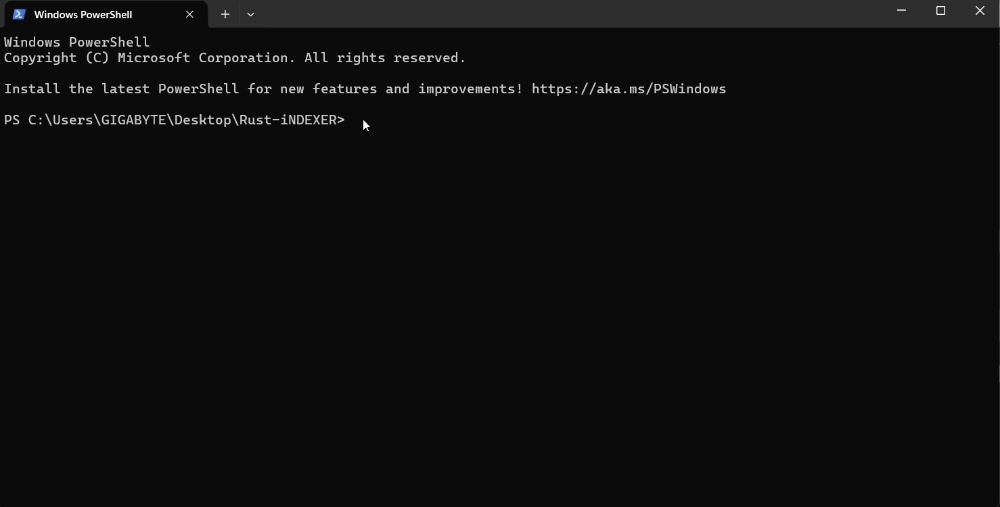
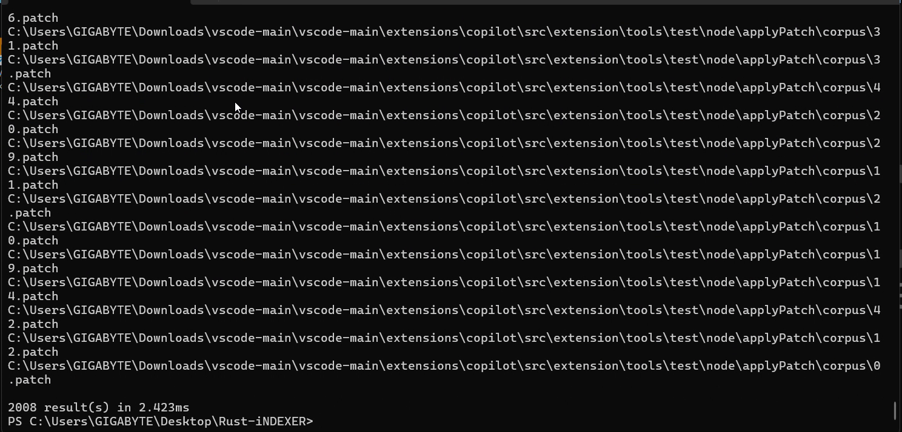

# Fast-Indexer (cix) — Blazing Fast trigram-based code indexer

Fast-Indexer is a Rust-based, trigram-driven incremental indexer and searcher for local codebases. Build an on-disk index once, then run sub-millisecond substring queries over file paths using memory-mapped Roaring bitmaps ([Roaring](https://github.com/RoaringBitmap/roaring-rs)).

## Features

- **Parallel crawl** ([`ignore`](https://docs.rs/ignore), same family as ripgrep) — respects **`.gitignore`**, **`.ignore`**, and optional **`.cixignore`**
- **Trigram extraction** (Rayon) and **compressed posting lists** (Roaring bitmaps)
- **No extension allowlist** — anything that passes ignore rules, size limits, and a quick binary sniff is indexed (tune with `.cixignore` for images, `node_modules`, etc.)
- **`search`** — substring queries via trigram intersection; index opened with **mmap** (lazy paging)
- **`stats`** — document and trigram counts
- **`watch`** — filesystem watch with debounced rebuild (experimental)

## Requirements

- **Rust** 1.70+ (2021 edition)
- Windows, macOS, or Linux

## Build

```bash
cargo build --release
```

Binary: `target/release/cix` (or `cix.exe` on Windows).

### Windows (PowerShell)

After `cargo build --release`, run the binary **from the repo root** with a **backslash** before `target`:

```powershell
.\target\release\cix.exe index "C:\path\to\project"
.\target\release\cix.exe search "query" --index "C:\path\to\project\.cix-index"
```

- **`.\cix.exe`** only works if `cix.exe` is actually in the current folder (it is not copied there by `cargo build`).
- **`.target\...`** (dot only) is wrong — PowerShell treats that like a module name. Use **`.\target\...`** (backslash-dot).

If you indexed VS Code at `C:\...\vscode`, the default index is **`C:\...\vscode\.cix-index`**. From another folder (e.g. this repo), you **must** pass `--index` to that path, or `search` looks for `.cix-index` in the current directory and will miss your index.

## Usage

Index a directory (writes `.cix-index` in that directory by default):

```bash
cix index /path/to/project
# or explicit output:
cix index /path/to/project -o /path/to/.cix-index
```

Search (from the project root, or pass `--index`):

```bash
cix search "fn main"
cix search "SomeType" --index /path/to/.cix-index
```

Statistics:

```bash
cix stats
cix stats --index /path/to/.cix-index
```

Watch and rebuild (debounced full rebuild):

```bash
cix watch /path/to/project
```

## Ignore rules

| Mechanism | Role |
|-----------|------|
| **`.gitignore`** | Applied automatically in each directory (and parents), like ripgrep |
| **`.ignore`** | Extra ignore patterns (see `ignore` crate / ripgrep behavior) |
| **`.cixignore`** | Optional **additional** excludes (same syntax). Use for assets, vendored trees, or paths not in git |

Large trees (e.g. Linux kernel, monorepos) can take **minutes** on first index; use `.cixignore` to skip heavy dirs if needed.

## Limitations

- Search returns **matching file paths** (trigram filter + intersection); **line numbers** (`--lines`) are not fully implemented yet
- **Watch** currently triggers a **full re-index** after debounce (incremental posting updates are future work)
- Queries shorter than 3 characters use a simplified fallback

## How it compares

| Tool | Role |
|------|------|
| **ripgrep** | Line-oriented search; scans files (very fast, no persistent index) |
| **cix** | **Persistent trigram index** for repeated searches over the same tree |

Use cix when you want **many searches** against a **fixed** codebase without rescanning disk every time.

## License

MIT — see [LICENSE](LICENSE).

## Contributing

Issues and pull requests are welcome. Please run `cargo test` before submitting.

After you create the GitHub repo, add `repository = "https://github.com/…"` under `[package]` in `Cargo.toml` if you publish to crates.io.

### Push to GitHub (first time)

```bash
git init
git add .
git commit -m "Initial commit: cix trigram indexer"
git branch -M main
git remote add origin https://github.com/YOUR_USER/YOUR_REPO.git
git push -u origin main
```

Enable **Actions** in the repo settings if CI workflows do not run automatically.

## Demos

Inline video preview (plays on GitHub when file is in the repository):


Thumbnail previews (click to play):

[](https://github.com/josephsenior/Fast-Indexer/raw/main/demo/sans-titre.mp4)

[](https://github.com/josephsenior/Fast-Indexer/raw/main/demo/screen-recording-2026-04-18-184705.mp4)

Inline playback (small file):

<video controls width="720">
  <source src="https://raw.githubusercontent.com/josephsenior/Fast-Indexer/main/demo/sans-titre.mp4" type="video/mp4">
  Your browser does not support the video tag.
</video>

If your videos are large, consider using Git LFS (already enabled for `demo/*.mp4`) or hosting on YouTube/Vimeo and linking from the README.
